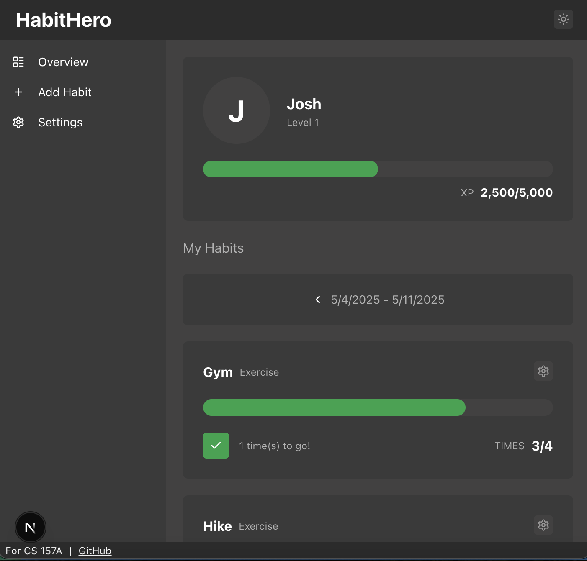

# HabitHero

Created by Josh Dittmer and Sidharth Krishnaswamy

## Project Overview

HabitHero is a gamified habit tracking web app that allows users to set weekly habits, log their completions, and earn experience points. Our interface allows users to create habits, log completions, and track their progress over time in a fun, visually pleasing way. The main purpose of our project is to promote healthy lifestyles by making personal growth feel like a video game. Game-like elements make users more likely to build and maintain healthy habits over time because they make doing so feel fun and rewarding.

## Instructions to Build & Run

1. Setup authentication at https://manage.auth0.com/
    <ol type="a">
    <li>Create a new Regular Web Application using the Auth0 management console</li>
    <li>Record the domain, client ID, and client secret for this application</li>
    <li>Create a new API using the Auth0 management console with the identifier/audience "habithero"</li>
    <li>Ensure the JWT profile is set to "Auth0"</li>
    <li>Add a new permission with the name "habits"</li>
    </ol>

2. Clone the Git repository
3. Start MySQL
    <ol type="a">
    <li>This repository contains a Docker Compose file to easily run MySQL with the correct configuration</li>
    <li>To start the container, run:
     
    <code>cd docker && docker compose up -d</code>
    </li>
    <li>Otherwise, ensure your MySQL database has:
        <ol>
            <li>A user with the username "mysql" and the password "admin"</li>
            <li>A database with the name "HabitHero"</li>
        </ol>
    </li>
    </ol>
4. Configure and run the backend
    <ol type="a">
    <li>Open the "backend" folder in IntelliJ IDEA (located in the root directory of the repository)</li>
    <li>Upon opening the project, all required dependencies should automatically install. In case they don't, right click pom.xml and click Maven > Reload project</li>
    <li>Locate the file "application.yml.example" in src/main/resources</li>
    <li>Create a copy of this file called "application.yml"</li>
    <li>Replace the "issuer" field with the domain from the Auth0 application you created earlier</li>
    <li>Build and run the project</li>
    </ol>
4. Configure the frontend
    <ol type="a">
    <li>Open the "frontend" folder</li>
    <li>Install required npm packages by running:
     
    <code>npm install</code>
    </li>
    <li>Locate the file ".env.local.example"</li>
    <li>Create a copy of this file called ".env.local</li>
    <li>Set AUTH0_SECRET to a long secret value. You can generate one with:
     
    <code>openssl rand -hex 32</code>
    </li>
    <li>Set AUTH0_DOMAIN to the domain for your Auth0 tenant</li>
    <li>Set AUTH0_CLIENT_ID to the client ID for your previously-created Auth0 application</li>
    <li>Set AUTH0_CLIENT_SECRET to the client secret for your previously-created Auth0 application</li>
    <li>Start the application by running:
     
    <code>npm run dev</code>
    </li>
    </ol>
5. You can now access HabitHero by opening http://localhost:3000/ in a web browser

## Required Software & Dependencies

### Required Software
1. Node.js v23.0.0
2. npm v11.0.0
3. IntelliJ IDEA 2023.3.3
4. Docker with Docker Compose
5. MySQL Enterprise

### Frontend Dependencies
1. Auth0
2. Tanstack Query
3. io-ts
4. Lucide React
5. Motion
6. Next.js
7. React

### Backend Dependencies
1. Spring Boot with the following starters:
    * spring-boot-starter-web
    * spring-boot-starter-test
    * okta-spring-boot-starter
    * spring-boot-starter-data-jdbc
    * spring-boot-starter-data-jpa
2. MySQL Connector

## Additional Configuration

### Frontend

All configuration for the frontend is performed in the ".env.local" file you created. In this file, you can customize:
* Auth0 environment variables
* The server's port
* The URL for the backend API

## Backend

Configuration for the backend is performed in the "application.yml" file you created at src/main/resources. In this file, you can customize:
* The oauth2 issuer
* The oauth2 audience
* The server's port

The database URL, username, and password can be configured by editing:
**src/main/java/.../config/datasource/DataSourceConfig.java**